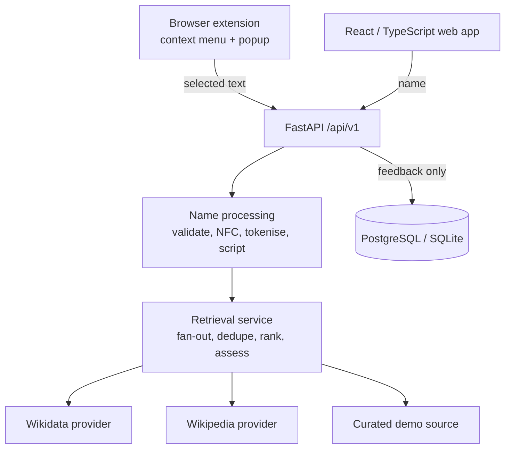

# NameLens

A research-oriented prototype that looks up public information about a personal name and shows, for every claim, which source said it, what type of source it is, and how uncertain the result is.

> NameLens is an independent portfolio project. It is **not** affiliated with Dublin City University or the MyNameIS project, and it is not an implementation of MyNameIS.

## Live demo

- **Web app:** https://leumaslarotrebor.github.io/namelens/
- **API health:** https://namelens-api.onrender.com/api/v1/health
- **Suggested 60-second tour:** open the site → choose 山田 太郎 or محمد بن سلمان from the script table → read *Confidence and uncertainty* → expand *Show evidence* and *How this result was produced* → try a name with no entry (e.g. *Zzyzx*) to see the "insufficient information" state.

## Why NameLens?

Personal names are written in many scripts, can be encoded in more than one way in Unicode, follow different conventions across cultures, and are pronounced differently by different people and communities. Public sources disagree, are incomplete, or say nothing at all. Software that presents a single confident answer hides all of that.

NameLens explores the opposite design: retrieve from several sources, keep each claim tied to its provenance, show disagreement, and say "Insufficient reliable information found." when that is the honest answer. It is a technical prototype for exploring evidence-based retrieval and presentation of name information. It is not a study, and it makes no claim to linguistic authority.

## Research relevance

| Theme | Where it shows up |
|---|---|
| Multilingual representation | Unicode NFC normalisation, script detection for Latin, Tamil, Devanagari, Arabic, Cyrillic, Greek, Han, Hiragana/Katakana, Hangul and more; RTL-safe rendering; no assumed given/family order |
| Information retrieval | Provider abstraction, concurrent retrieval, matching insensitive to case and diacritics, de-duplication, ranking by source type, in-memory cache |
| Provenance | Every claim lists its sources, source type, supporting excerpt and retrieval time |
| Uncertainty | Rule-based confidence label (none / low / moderate), visible disagreement, ambiguity notes, provider-failure reporting, explicit "not available" states |
| Pronunciation | Shown only when a source returned it; regional variants kept apart; audio only when Wikidata links a Commons file |
| User feedback | Useful / pronunciation correct / suggested correction, with user-initiated deletion |
| Web technologies | React + TypeScript web app, Chrome Manifest V3 extension, FastAPI + PostgreSQL API |

See [docs/mynameis-relevance.md](docs/mynameis-relevance.md) for a requirement-by-requirement mapping including limitations, and [docs/research-notes.md](docs/research-notes.md) for the design rationale and evaluation plan.

## Architecture



Analyses are **not** stored. Only feedback that a user chooses to submit is persisted. In Docker the API also serves the built web app, so one container is one deployable unit.

## Features

- Name lookup with normalisation, script detection, particle and ambiguity notes
- Evidence view: claims grouped per name part, each with sources, source type, excerpt and timestamp
- Confidence and uncertainty label with a plain-language reason; conflicting sources shown side by side
- "How this result was produced" panel built only from fields the API returned
- Pronunciation (IPA and Commons audio) when available, otherwise an explicit unavailable state
- Feedback with delete-my-feedback
- Chrome extension: select a name, right-click, "Explore this name with NameLens"; compact result with feedback and a link to the full view
- Accessible, responsive UI with light and dark colour schemes

## Technical stack

Python 3.12, FastAPI, Pydantic, SQLAlchemy, PostgreSQL (SQLite for tests and quick local runs), httpx · React 18, TypeScript, Vite, React Router · Chrome Manifest V3, TypeScript, esbuild · pytest, Vitest, Testing Library, axe-core · ruff, ESLint (with jsx-a11y) · Docker, GitHub Actions.

## Multilingual / Unicode handling

Implemented in `backend/app/nameproc.py` and covered by tests:

- Control and bidirectional-override characters are stripped; zero-width joiners are kept because Persian and Indic scripts use them
- NFC normalisation, so composed and decomposed forms of the same name are equal
- Unicode whitespace (including NBSP and ideographic space) collapsed
- Apostrophes (straight and typographic) and hyphens preserved; hyphenated parts looked up whole and split
- Script detection from Unicode character names; mixed-script input flagged
- Name particles (de, van, bin, and Arabic بن/ابن/بنت among others) recognised but never assumed to belong to a particular part
- Names with no spaces in CJK scripts flagged as having an unknown part boundary
- Matching against sources ignores case and diacritics (display never does)

Script detection is deliberately lightweight: it reports character properties, not language.

## Evidence and uncertainty

Design principle: *the interface should say what was found, where it came from, and how sure the system is.* Concretely:

- **none**: no source had an entry. The UI says so and does not guess.
- **low**: one source only, only curated demo data, or sources disagree.
- **moderate**: at least one claim is stated by two independent, non-demo sources that agree and nothing conflicts.

This is a rule-based label, not a probability. It says nothing about how a specific person pronounces or spells their own name.

## Quick start

```bash
# one command with Docker (PostgreSQL + app on http://localhost:8000)
docker compose up --build
```

Without Docker:

```bash
make setup            # venv + npm ci for web and extension
make run              # builds the web app and serves everything on http://localhost:8000
```

Web development with hot reload: `cd backend && python3 -m uvicorn app.main:app --reload` and, in another terminal, `cd web && npm run dev` (http://localhost:5173, API proxied to :8000).

Copy `.env.example` to `.env` to change settings. No API keys are needed.

## Browser extension

```bash
cd extension
API_BASE=http://localhost:8000 WEB_BASE=http://localhost:8000 npm run build
```

Then open `chrome://extensions`, enable Developer mode, choose **Load unpacked** and select `extension/dist`. Select a name on any page, right-click and choose **Explore this name with NameLens**. Details, permissions and behaviour are in [extension/README.md](extension/README.md). The extension is not published to the Chrome Web Store.

## Testing

Results from the last run in the development environment:

| Suite | Command | Result |
|---|---|---|
| Backend (pytest) | `cd backend && python3 -m pytest -q` | 80 passed |
| Web (Vitest, includes axe-core checks) | `cd web && npm test` | 39 passed |
| Extension (Vitest) | `cd extension && npm test` | 31 passed |

Also run and passing: `ruff check`, ESLint on web and extension, `tsc --noEmit` on both, `npm run build` for web and extension. `make test` runs all three suites; `make lint` runs the linters.

What is not covered: no test drives a real Chrome instance with the unpacked extension, and no test calls the live Wikidata or Wikipedia APIs (provider tests use mocked HTTP transports). The Docker image and compose file were written but not built in the environment where this was developed, so treat them as untested until you run `docker compose up --build`.

## Privacy and security

See [PRIVACY.md](PRIVACY.md) and [SECURITY.md](SECURITY.md). In short: analyses are not stored, feedback is, third-party providers receive name parts, and nothing here is a compliance claim.

## Accessibility

Skip link, landmarks, focus moved to the main region on navigation, visible focus rings, labelled controls, radio groups for yes/no feedback, `role="alert"` for errors and `role="status"` for progress, meaning never conveyed by colour alone, `dir="auto"` on names for right-to-left text, reduced-motion support. Automated axe-core checks run in the web test suite. Details and gaps are in [ACCESSIBILITY.md](ACCESSIBILITY.md).

## Limitations

- The curated pronunciation source has only a handful of hand-entered entries.
- Wikidata coverage of names is incomplete and most names have no pronunciation there.
- Information from these sources is not authoritative and can be wrong.
- Script detection is lightweight and does not identify languages.
- Provider integration is unit-tested against mocked responses; live behaviour was spot-checked by hand (a lookup of García on 21 Sep 2026 returned Wikidata and Wikipedia evidence) but has not been evaluated systematically.
- No user study, interviews or retrieval evaluation have been carried out; nothing in this repository reports research results.
- No claim of comprehensive linguistic or cultural coverage.
- No authentication, rate limiting or retention policy; not suitable for public production use as-is.
- No screenshots are included because they could not be generated in the development environment.

## Future research directions (not implemented)

User research with people whose names are frequently mis-rendered; recording and validating pronunciation with the name owner; phonetic representation beyond IPA text; multilingual evaluation sets; larger validated datasets; systematic retrieval evaluation against agreed relevance judgements; cultural and contextual validation of naming-convention assumptions.

## Repository layout

```
backend/     FastAPI app, retrieval providers, tests
web/         React + TypeScript app, tests
extension/   Chrome Manifest V3 extension, tests
docs/        research notes, MyNameIS relevance mapping, interview notes
```

## Licence

MIT. See [LICENSE](LICENSE).
